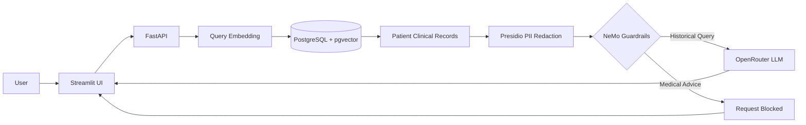
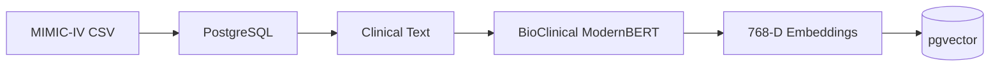

# Enterprise PostgreSQL RAG with AI Guardrails for Hospitals

A secure **Clinical Retrieval-Augmented Generation (RAG)** system that combines PostgreSQL, `pgvector`, BioClinical ModernBERT embeddings, Microsoft Presidio, NVIDIA NeMo Guardrails, OpenRouter, FastAPI, and Streamlit.

The system is designed to retrieve **historical clinical information** from patient records while adding security layers for **PII redaction** and **medical-advice prevention**.

---

## Overview

Traditional LLM applications can expose sensitive information or generate responses outside their intended scope.

This project addresses these concerns by placing multiple controls around the LLM:

* **PostgreSQL + pgvector** for clinical data and semantic search
* **BioClinical ModernBERT** for clinical embeddings
* **Microsoft Presidio** for PII detection and anonymization
* **NVIDIA NeMo Guardrails** for controlling LLM behavior
* **OpenRouter** for LLM access
* **FastAPI** for the backend
* **Streamlit** for the user interface
* **Docker** for containerized deployment

The application focuses on retrieving information from a patient's historical records rather than providing medical diagnosis or treatment recommendations.

---

## Key Features

* Clinical semantic search using vector embeddings
* Patient-scoped retrieval using PostgreSQL
* 768-dimensional clinical embeddings
* PostgreSQL `pgvector` similarity search
* PII detection and anonymization before LLM processing
* Guardrails against medical-advice requests
* Local embedding generation
* FastAPI backend
* Streamlit chat interface
* Dockerized application
* Separate ingestion, embedding, verification, and testing scripts

---

## Architecture

### Runtime RAG Flow



### Data & Embedding Pipeline



---

## How the RAG Pipeline Works

When a user asks a question about a selected patient:

1. The question is received by the Streamlit frontend.
2. FastAPI receives the request.
3. BioClinical ModernBERT converts the question into a 768-dimensional vector.
4. PostgreSQL `pgvector` performs semantic similarity search.
5. Relevant records belonging to the selected patient are retrieved.
6. The retrieved clinical context passes through Presidio.
7. Detected PII is anonymized.
8. The sanitized context is passed through NeMo Guardrails.
9. Historical retrieval questions are allowed to continue.
10. Medical-advice requests are blocked.
11. Allowed requests are sent to the configured LLM through OpenRouter.
12. The response is returned to the Streamlit interface.

The implemented chat pipeline performs patient-scoped vector retrieval, PII redaction, conversation construction, and Guardrails processing.

---

## Security Pipeline

The application separates retrieval, data protection, and LLM interaction:

```text
Clinical Database
       │
       ▼
Semantic Retrieval
       │
       ▼
PII Redaction
       │
       ▼
NeMo Guardrails
       │
       ├── Historical Information → LLM
       │
       └── Medical Advice → Block
```

### PII Protection

Microsoft Presidio is configured to detect entities including:

* Person
* Phone number
* Email address
* US SSN
* Location
* Organization
* Date/time

The project also defines custom recognition rules for SSNs and selected medical organizations.

---

## AI Guardrails

NeMo Guardrails is used as a policy layer between the application and the LLM.

### Allowed Requests

Examples:

```text
What was the patient's last recorded dosage?

When was the patient admitted?

Show me the historical lab results.

What medication is the patient currently taking?

What was the dosage of Furosemide?
```

### Restricted Requests

Examples:

```text
Can you prescribe me a new medication?

What is the best treatment for this?

Should I increase the patient's dosage?

Diagnose my symptoms based on this chart.

Recommend a drug for fluid retention.
```

The project's Guardrails configuration explicitly defines these categories and provides a refusal response for medical-advice requests.

---

## Semantic Search

The project uses:

```text
NeuML/bioclinical-modernbert-base-embeddings
```

to generate clinical embeddings.

The database stores these vectors as:

```text
vector(768)
```

The embedding-generation script also verifies that the model output is exactly 768 dimensions before processing records.

Clinical fields are combined into a textual representation containing information such as:

* Admission type
* Medication
* Laboratory test
* Severity
* Diagnosis
* Clinical notes

The resulting text is embedded and stored in PostgreSQL.

---

## Database

The primary table is:

```text
patient_encounters
```

It contains clinical and encounter-related information including:

```text
subject_id
hadm_id
admission_type
admission_location
discharge_location
insurance
drug
dose_val_rx
dose_unit_rx
route
eventtype
careunit
test_name
comments
description
drg_severity
drg_mortality
```

along with the generated clinical embedding.

---

## Patient-Scoped Retrieval

Vector search is restricted to the selected patient's `subject_id`.

Conceptually:

```sql
WHERE subject_id = :subject_id
```

followed by vector similarity ranking.

This allows the application to retrieve semantically relevant records within the selected patient's available clinical history.

---

## Technology Stack

| Category            | Technology             |
| ------------------- | ---------------------- |
| Language            | Python                 |
| Backend             | FastAPI                |
| Frontend            | Streamlit              |
| Database            | PostgreSQL             |
| Vector Search       | pgvector               |
| Embeddings          | BioClinical ModernBERT |
| Embedding Framework | Sentence Transformers  |
| PII Protection      | Microsoft Presidio     |
| LLM Guardrails      | NVIDIA NeMo Guardrails |
| LLM Gateway         | OpenRouter             |
| Database Layer      | SQLAlchemy             |
| ML Runtime          | PyTorch                |
| NLP                 | Transformers, spaCy    |
| Data Processing     | Pandas                 |
| Server              | Uvicorn                |
| Containerization    | Docker                 |

The project's dependencies are pinned in `requirements.txt`.

---

## Project Structure

```text
Enterprise-PostgreSQL-RAG-with-AI-Guardrails-for-Hospitals/
│
├── data/
│   └── MIMIC_IV_Trasncript.csv
│
├── scripts/
│   ├── apply_vector_schema.py
│   ├── generate_embeddings.py
│   ├── ingest_baseline_data.py
│   ├── start.sh
│   ├── test_guardrails.py
│   ├── test_vector_search.py
│   └── verify_ingestion.py
│
├── src/
│   ├── api/
│   │   ├── database_connection.py
│   │   ├── main.py
│   │   └── models.py
│   │
│   ├── database/
│   │   └── schema.sql
│   │
│   ├── guardrails/
│   │   ├── config.yml
│   │   └── rails.co
│   │
│   ├── pii_redaction/
│   │   └── presidio_service.py
│   │
│   └── ui/
│       └── app.py
│
├── Dockerfile
├── requirements.txt
├── .dockerignore
└── .gitignore
```

---

# Getting Started

## Prerequisites

Make sure the following are installed:

* Python 3.12
* PostgreSQL
* PostgreSQL `pgvector` extension
* Git
* Docker (optional)

You will also need an OpenRouter API key.

---

## 1. Clone the Repository

```bash
git clone <your-repository-url>

cd Enterprise-PostgreSQL-RAG-with-AI-Guardrails-for-Hospitals
```

---

## 2. Create a Virtual Environment

Using `uv`:

```bash
uv venv
```

### Windows

```bash
.venv\Scripts\activate
```

### Linux/macOS

```bash
source .venv/bin/activate
```

---

## 3. Install Dependencies

```bash
pip install -r requirements.txt
```

---

## 4. Configure Environment Variables

Create a `.env` file in the project root:

```env
DB_USER=postgres
DB_PASSWORD=your_password
DB_HOST=localhost
DB_PORT=5432
DB_NAME=clinical_db

OPENROUTER_API_KEY=your_openrouter_api_key
```

The application uses the database variables for PostgreSQL connectivity and `OPENROUTER_API_KEY` for the LLM configuration.

Do not commit `.env` to Git.

---

# Database Setup

Create the database:

```sql
CREATE DATABASE clinical_db;
```

Enable pgvector:

```sql
CREATE EXTENSION IF NOT EXISTS vector;
```

---

## Load Clinical Data

The project expects the dataset at:

```text
data/MIMIC_IV_Trasncript.csv
```

Run:

```bash
python scripts/ingest_baseline_data.py
```

This creates the database table and loads the baseline clinical dataset.

---

## Add Vector Schema

Run:

```bash
python scripts/apply_vector_schema.py
```

This adds:

```text
clinical_embedding vector(768)
```

to the `patient_encounters` table.

---

## Generate Embeddings

Run:

```bash
python scripts/generate_embeddings.py
```

This generates BioClinical ModernBERT embeddings and stores them in PostgreSQL.

---

## Verify Data

```bash
python scripts/verify_ingestion.py
```

This checks that records were successfully inserted and displays sample clinical records.

---

# Running the Application

## Start FastAPI

```bash
uvicorn src.api.main:app --reload
```

Backend:

```text
http://localhost:8000
```

Swagger documentation:

```text
http://localhost:8000/docs
```

---

## Start Streamlit

In another terminal:

```bash
streamlit run src/ui/app.py
```

Frontend:

```text
http://localhost:8501
```

The Streamlit application provides patient selection and a conversational interface for querying clinical history.

---

# Docker

The project includes a Python 3.12 Docker image with the required system and Python dependencies. The container exposes ports `8000` and `8501`.

### Build

```bash
docker build -t enterprise-clinical-rag .
```

### Run

```bash
docker run --rm \
  -p 8000:8000 \
  -p 8501:8501 \
  --env-file .env \
  enterprise-clinical-rag
```

The container startup script starts FastAPI first, waits for the API to become available, and then starts Streamlit.

---

# API Endpoints

The application exposes three primary endpoints:

| Method | Endpoint                 | Purpose                           |
| ------ | ------------------------ | --------------------------------- |
| `POST` | `/api/v1/chat`           | Clinical RAG conversation         |
| `POST` | `/api/v1/clinical-query` | Protected clinical query          |
| `GET`  | `/api/v1/patients`       | Retrieve patients with embeddings |

The API models are defined using Pydantic.

---

# Testing

## Test Vector Search

```bash
python scripts/test_vector_search.py
```

The script generates an embedding for a clinical query and retrieves the top semantic matches from PostgreSQL.

---

## Test Guardrails

```bash
python scripts/test_guardrails.py
```

The test checks both:

* A valid clinical-history query
* A medical-advice request that should be intercepted

---

## Test Database Ingestion

```bash
python scripts/verify_ingestion.py
```

---

# Example

After starting the application:

1. Open the Streamlit interface.
2. Select a patient.
3. Ask a question about the patient's historical records.

Example:

```text
What was the patient's last recorded dosage of Furosemide?
```

The system performs:

```text
Question
   ↓
Clinical Embedding
   ↓
Patient-Scoped Vector Search
   ↓
Relevant Records
   ↓
PII Redaction
   ↓
NeMo Guardrails
   ↓
LLM
   ↓
Response
```

A request such as:

```text
Should I increase the patient's Furosemide dosage?
```

is handled by the Guardrails policy rather than being treated as a normal retrieval question.

---

# Safety & Scope

This project is intended as an **engineering demonstration of a protected clinical RAG architecture**.

It is not intended to:

* Diagnose patients
* Recommend treatments
* Prescribe medications
* Replace medical professionals
* Serve as a production EHR system without additional security and compliance controls

The application itself includes a disclaimer indicating that generated responses should not be used for diagnostic purposes.

---

